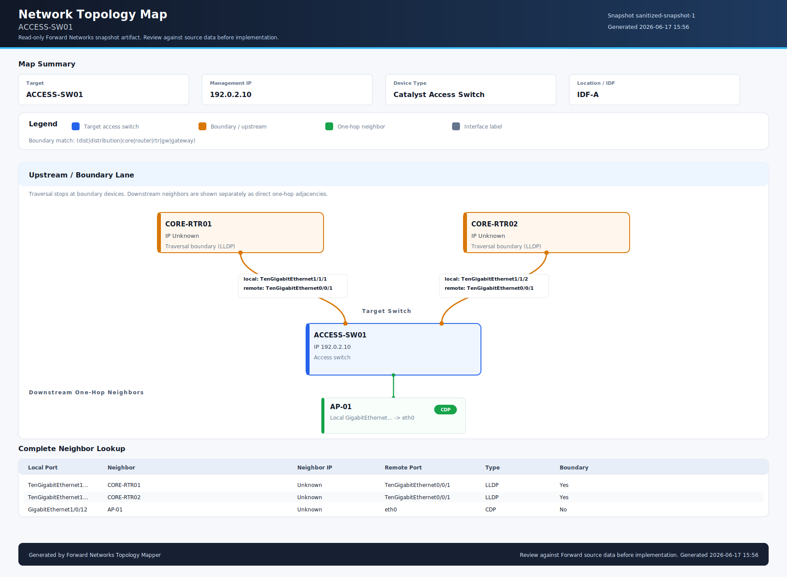

# Forward Networks Topology Blueprint: access-sw01.example.net

## Source

- Snapshot ID: `example-snapshot-001`
- Scope: target switch plus active one-hop topology/CDP/LLDP neighbors only.
- Traversal boundary: upstream gateway/router devices are included but not expanded.

## Target Switch

| Field | Value |
| --- | --- |
| Hostname | `access-sw01.example.net` |
| Primary IP | `192.0.2.10` |
| Device type | `ACCESS_SWITCH` |
| Location / IDF / closet | `IDF-A` |

## Active Topology Neighbors

| Local interface | Protocol | Neighbor | Neighbor IP | Remote port | Boundary |
| --- | --- | --- | --- | --- | --- |
| `TenGigabitEthernet1/1/1` | CDP | `core-gw01.example.net` | `198.51.100.1` | `TwentyFiveGigE1/0/22` | Yes |
| `TenGigabitEthernet2/1/8` | CDP | `core-gw02.example.net` | `198.51.100.2` | `TwentyFiveGigE1/0/22` | Yes |
| `GigabitEthernet1/0/11` | LLDP | `ap-101.example.net` | `192.0.2.101` | `eth0` | No |
| `GigabitEthernet1/0/12` | CDP | `camera-201.example.net` | `192.0.2.201` | `eth0` | No |
| `GigabitEthernet1/0/13` | LLDP | `phone-301.example.net` | `192.0.2.130` | `port1` | No |

## Network Map

